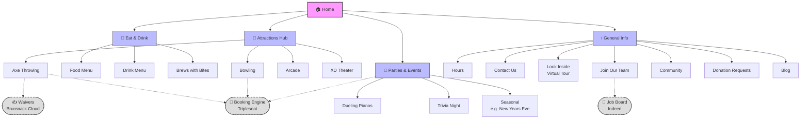

# Visual Sitemap

This diagram illustrates the structure and connectivity of the Stratosphere Social website.

```mermaid
graph TD
    %% Main Nodes
    Home[🏠 Home]
    
    %% Categories
    EatDrink[🍔 Eat & Drink]
    Attractions[🎳 Attractions Hub]
    Events[🎉 Parties & Events]
    Info[ℹ️ General Info]
    
    %% External Systems
    Booking([📅 Booking Engine<br/>Tripleseat])
    Waiver([✍️ Waivers<br/>Brunswick Cloud])
    Jobs([💼 Job Board<br/>Indeed])
    
    %% Connections from Home
    Home --> EatDrink
    Home --> Attractions
    Home --> Events
    Home --> Info
    
    %% Eat & Drink Subpages
    EatDrink --> Food[Food Menu]
    EatDrink --> Drink[Drink Menu]
    EatDrink --> Brews[Brews with Bites]
    
    %% Attractions Subpages
    Attractions --> Bowling[Bowling]
    Attractions --> Arcade[Arcade]
    Attractions --> XD[XD Theater]
    Attractions --> Axe[Axe Throwing]
    
    %% Events Subpages
    Events --> Dueling[Dueling Pianos]
    Events --> Trivia[Trivia Night]
    Events --> Seasonal[Seasonal<br/>e.g. New Years Eve]
    
    %% Info Subpages
    Info --> Hours[Hours]
    Info --> Contact[Contact Us]
    Info --> Tour[Look Inside<br/>Virtual Tour]
    Info --> Team[Join Our Team]
    Info --> Community[Community]
    Info --> Donate[Donation Requests]
    Info --> Blog[Blog]
    
    %% Cross-Links & Integrations
    Events -.-> Booking
    Bowling -.-> Booking
    Axe -.-> Booking
    Axe -.-> Waiver
    Team -.-> Jobs
    
    %% Styling
    classDef main fill:#f9f,stroke:#333,stroke-width:2px;
    classDef category fill:#bbf,stroke:#333,stroke-width:1px;
    classDef external fill:#ddd,stroke:#333,stroke-width:1px,stroke-dasharray: 5 5;
    
    class Home main;
    class EatDrink,Attractions,Events,Info category;
    class Booking,Waiver,Jobs external;
```
