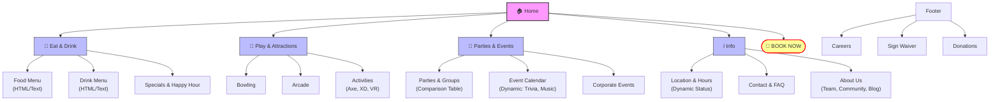

# Stratosphere Social v2 - Proposed Architecture

This sitemap represents the optimized structure for the modern v2 website, focusing on user journey and conversion.

```mermaid
graph TD
    %% Main Nodes
    Home["🏠 Home"]
    
    %% Primary Navigation (Header)
    Nav_Eat["🍔 Eat & Drink"]
    Nav_Play["🎳 Play & Attractions"]
    Nav_Events["🎉 Parties & Events"]
    Nav_Info["ℹ️ Info"]
    CTA_Book(["📅 BOOK NOW"])
    
    %% Home Connections
    Home --> Nav_Eat
    Home --> Nav_Play
    Home --> Nav_Events
    Home --> Nav_Info
    Home --> CTA_Book
    
    %% Eat & Drink (Consolidated)
    Nav_Eat --> Food["Food Menu<br/>(HTML/Text)"]
    Nav_Eat --> Drink["Drink Menu<br/>(HTML/Text)"]
    Nav_Eat --> Specials["Specials & Happy Hour"]
    
    %% Play (Attractions)
    Nav_Play --> Bowling["Bowling"]
    Nav_Play --> Arcade["Arcade"]
    Nav_Play --> Activities["Activities<br/>(Axe, XD, VR)"]
    
    %% Events (Revenue Drivers)
    Nav_Events --> Parties["Parties & Groups<br/>(Comparison Table)"]
    Nav_Events --> Calendar["Event Calendar<br/>(Dynamic: Trivia, Music)"]
    Nav_Events --> Corporate["Corporate Events"]
    
    %% Info (Utility)
    Nav_Info --> Location["Location & Hours<br/>(Dynamic Status)"]
    Nav_Info --> Contact["Contact & FAQ"]
    Nav_Info --> About["About Us<br/>(Team, Community, Blog)"]
    
    %% Footer / Utility Links
    Footer["Footer"] --> Jobs["Careers"]
    Footer --> Waivers["Sign Waiver"]
    Footer --> Donations["Donations"]
    
    %% Key Improvements
    %% 1. "Eat & Drink" consolidates all F&B.
    %% 2. "Activities" groups smaller attractions to reduce clutter.
    %% 3. "Book Now" is a global CTA, not buried.
    %% 4. "Event Calendar" replaces scattered static pages.
    
    %% Styling
    classDef main fill:#f9f,stroke:#333,stroke-width:2px;
    classDef nav fill:#bbf,stroke:#333,stroke-width:1px;
    classDef cta fill:#ff9,stroke:#f00,stroke-width:2px;
    
    class Home main;
    class Nav_Eat,Nav_Play,Nav_Events,Nav_Info nav;
    class CTA_Book cta;
```